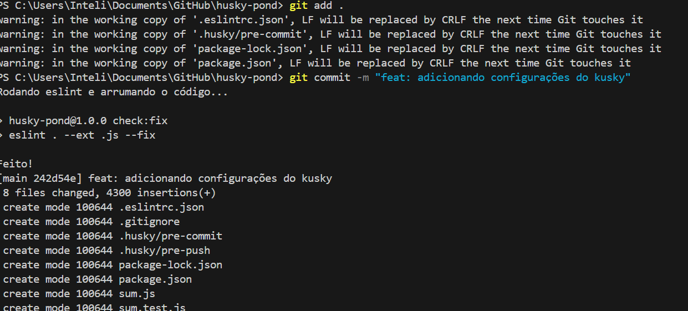
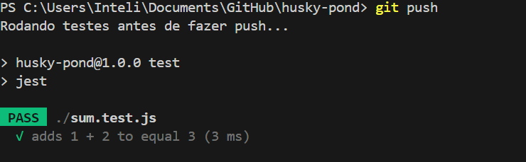

# Relatório: Configuração do Husky

## Etapas Realizadas

1. Criação do repositório `husky-pond` no GitHub.
2. Inicialização do projeto Node com `npm init -y`.
3. Instalação do Husky, ESLint e Jest.
4. Configuração dos hooks:
   - `pre-commit`: compila o código e executa o lint.
   - `pre-push`: executa os testes com Jest.
5. Criação de testes simples.
6. Execução de commits semânticos.

## Prints de Execução dos Hooks

### Pre-commit

### Pre-push

## Considerações Finais

Todos os hooks foram configurados com sucesso e estão funcionando corretamente, garantindo qualidade antes de envio ao repositório remoto.
